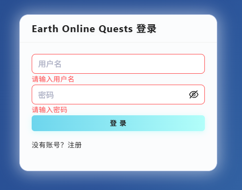

# Earth Online Quests

Earth Online Quests 是一个现代化的任务管理平台，前后端分离，支持多端访问，界面美观，体验流畅（真实情况：不好说，得看Cloudflare和运营商当天的心情）。项目采用 React + Ant Design + Vite 构建前端，Node.js + Express + MongoDB 构建后端，支持云端部署。（本人第一次接触Node.js，全是Cursor大人的功劳）

## 在线体验

👉 [点击访问 Earth Online Quests demo站点](https://earthonline.antares.xin/)

## 项目特色
- 现代化 UI，支持浅色渐变主题
- 任务管理、用户登录注册、进度追踪等功能（进度追踪，指只有完成未完成）
- 响应式设计，适配多端
- 前后端分离，接口安全可靠（真的安全吗，我不知道）

## 项目截图

---

感谢Cursor对本项目的大力支持（）
